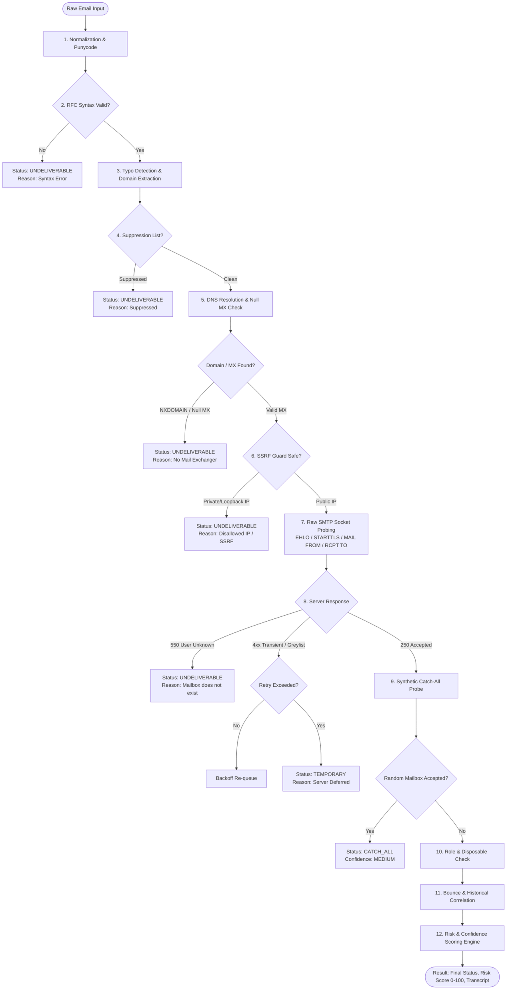
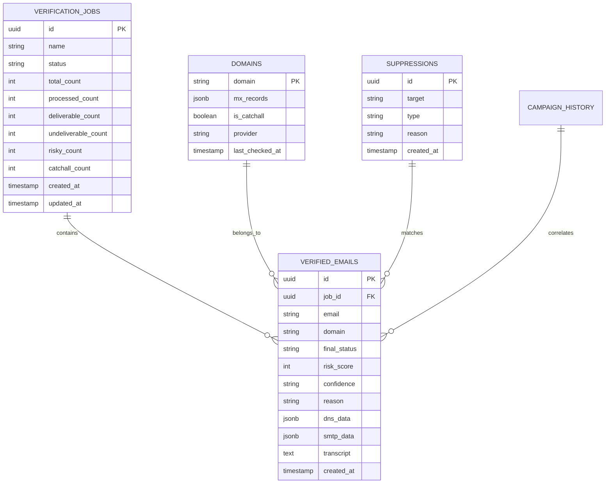

# MailGuard Technical Architecture & Internal Mechanics

> Comprehensive technical specification, pipeline lifecycle, concurrency model, and data schemas for MailGuard.

---

## 1. System Architecture Overview

MailGuard is designed as an autonomous, self-hosted email verification platform. It operates completely independently of commercial verification APIs (ZeroBounce, NeverBounce, Hunter, etc.), executing deterministic RFC-compliant verification directly against target mail exchangers.

```
┌─────────────────────────────────────────────────────────────────────────────┐
│                          Next.js 15 Web Application                         │
│       (App Router, React 19, Tailwind CSS, TanStack React Table, Zod)       │
└──────────────────────────────────────┬──────────────────────────────────────┘
                                       │ HTTP / Authenticated JSON REST
┌──────────────────────────────────────▼──────────────────────────────────────┐
│                            API & Middleware Guard                           │
│   (HMAC-SHA256 Session Cookie, Rate Limiting, SSRF Validator, RBAC Guard)   │
└───────────────────┬─────────────────────────────────────┬───────────────────┘
                    │                                     │
                    ▼                                     ▼
     ┌──────────────────────────────┐      ┌──────────────────────────────┐
     │    PostgreSQL 16 / PGlite    │      │    Database-Backed Queue     │
     │   (Drizzle ORM Relational)   │◄─────┤ (SKIP LOCKED Atomic Workers) │
     └──────────────┬───────────────┘      └──────────────┬───────────────┘
                    │                                     │
                    │               Job Task Allocation   │
                    ▼                                     ▼
┌─────────────────────────────────────────────────────────────────────────────┐
│                    Verification Orchestrator Engine                         │
│                                                                             │
│  ┌────────────────────────┐  ┌────────────────────────┐  ┌────────────────┐ │
│  │ 1. Punycode & Normal   │  │ 2. RFC Syntax Validator│  │ 3. Typo Lev.   │ │
│  └───────────┬────────────┘  └───────────┬────────────┘  └────────┬───────┘ │
│              │                           │                        │         │
│              ▼                           ▼                        ▼         │
│  ┌────────────────────────┐  ┌────────────────────────┐  ┌────────────────┐ │
│  │ 4. Suppression Lookup  │  │ 5. DNS MX Resolver     │  │ 6. SSRF Guard  │ │
│  └───────────┬────────────┘  └───────────┬────────────┘  └────────┬───────┘ │
│              │                           │                        │         │
│              ▼                           ▼                        ▼         │
│  ┌────────────────────────┐  ┌────────────────────────┐  ┌────────────────┐ │
│  │ 7. Raw SMTP Negotiator │  │ 8. Catch-All Probe     │  │ 9. Provider Sig│ │
│  └───────────┬────────────┘  └───────────┬────────────┘  └────────┬───────┘ │
│              │                           │                        │         │
│              ▼                           ▼                        ▼         │
│  ┌────────────────────────┐  ┌────────────────────────┐  ┌────────────────┐ │
│  │ 10. Role / Disposable  │  │ 11. Bounce Correlation │  │ 12. Risk Engine│ │
│  └────────────────────────┘  └────────────────────────┘  └────────────────┘ │
└─────────────────────────────────────────────────────────────────────────────┘
```

---

## 2. Verification Pipeline Lifecycle

Every email verified through MailGuard traverses a 12-stage sequential evaluation pipeline:



### Stage Details

1. **Normalization & Punycode**
   - Whitespace trimming, lowercasing domain component.
   - Internationalized Domain Names (IDN) converted to ASCII Punycode via RFC 5890.
2. **RFC Syntax Validation**
   - Validates total length (max 254 octets), local part (max 64 octets).
   - Validates character set adherence without vulnerable backtracking regular expressions.
3. **Typo Detection**
   - Levenshtein distance matching against popular webmail providers (`@gmai.com` -> `gmail.com`).
4. **Suppression Registry Lookup**
   - Fast lookup against local suppression list for prior spam complaints, unsubscriptions, and hard bounces.
5. **DNS & MX Resolution**
   - Resolves DNS MX records ordered by preference priority.
   - Evaluates RFC 7505 Null MX records (indicating the domain explicitly refuses email).
   - Falls back to DNS A/AAAA records if no MX records exist (RFC 5321 Section 5.1).
6. **Strict SSRF Protection Guard**
   - Resolves target MX hostnames to concrete IP addresses.
   - Prohibits connections to RFC 1918 private subnets, loopback addresses (`127.0.0.0/8`), link-local/cloud metadata (`169.254.169.254`), carrier-grade NAT (`100.64.0.0/10`), and IPv6 unique-local addresses.
7. **Raw SMTP Socket Probing**
   - Direct TCP socket connection on port 25.
   - Interacts with greeting banner (`220`).
   - Negotiates `EHLO`/`HELO` capabilities.
   - Initiates opportunistic `STARTTLS` encryption handshake where supported.
   - Transmits `MAIL FROM:<configured-from-address>`.
   - Transmits `RCPT TO:<candidate-mailbox>`.
   - **Guaranteed Zero Data Protocol:** Socket is strictly terminated with `QUIT`. The `DATA` command is **never** transmitted, ensuring no emails are ever dispatched.
8. **Synthetic Catch-All Probing**
   - Generates a synthetic, high-entropy non-existent mailbox (`__mg_catchall_<32-hex-chars>@domain`).
   - If the remote MTA accepts the synthetic mailbox with `250 OK`, the domain is classified as `CATCH_ALL`.
9. **Provider Signature Identification**
   - Matches MX banners and hosts against signature databases (Google Workspace, Microsoft 365, Proton, Zoho, Fastmail, Amazon SES, iCloud, SendGrid).
10. **Disposable & Role-Based Detection**
    - Matches domain against 3,000+ known temporary email services.
    - Matches local-part against functional role prefixes (`support@`, `billing@`, `sales@`, `admin@`).
11. **First-Party Reputation & Bounce Correlation**
    - Integrates historical campaign bounce logs to adjust scoring based on past actual delivery behavior.
12. **Deterministic Risk & Confidence Engine**
    - Synthesizes all 11 previous signals into an exact Risk Score (0–100) and Confidence Level (`HIGH`, `MEDIUM`, `LOW`).

---

## 3. Concurrency & Rate Limiting Architecture

To maintain high throughput without triggering remote server connection throttling or spam blocklists, MailGuard implements a multi-tier concurrency control system:

```
                                  Global Concurrency Cap
                                (Default: 10 concurrent jobs)
                                              │
                ┌─────────────────────────────┼─────────────────────────────┐
                ▼                             ▼                             ▼
        Domain Bucket: gmail.com      Domain Bucket: yahoo.com      Domain Bucket: custom.org
         (Max 2 concurrent jobs)       (Max 2 concurrent jobs)       (Max 2 concurrent jobs)
```

1. **Global Concurrency Limiter:** Constrains maximum simultaneous outbound TCP connections.
2. **Domain-Specific Leaky Bucket:** Groups verifications by target MX domain. Prevents sending rapid bursts to sensitive mail hosts (e.g., Google or Outlook).
3. **Adaptive Backoff & Jitter:** Automatically spaces requests upon receiving `421` (Server busy) or `450` (Greylisting) responses.

---

## 4. Database Schema & Data Models

MailGuard utilizes a relational schema optimized for high write performance and audit trail preservation:



---

## 5. Security Architecture

- **Isolated Network Sockets:** Outbound raw SMTP client code enforces a strict 64KB response memory ceiling to eliminate memory overflow and buffer exhaustion attacks.
- **Transcript Sanitization:** SMTP protocol logs are bounded to 2,000 characters and stripped of control characters before database persistence.
- **Single-Admin Cryptographic Authentication:** Admin sessions are sealed with HMAC-SHA256 signatures stored in `HttpOnly`, `SameSite=Strict` cookies. Passwords are never stored in plaintext and require salted SHA-256 hashes.
- **Zero Third-Party Telemetry:** No requests leave the host environment except direct DNS resolution and recipient mail server TCP probing.
